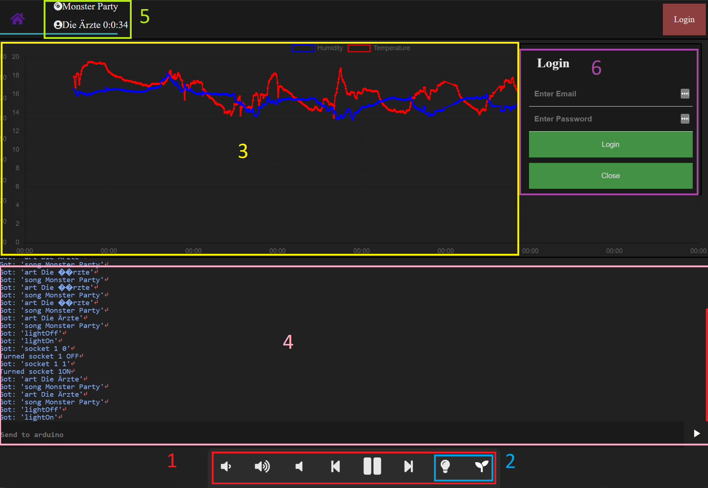
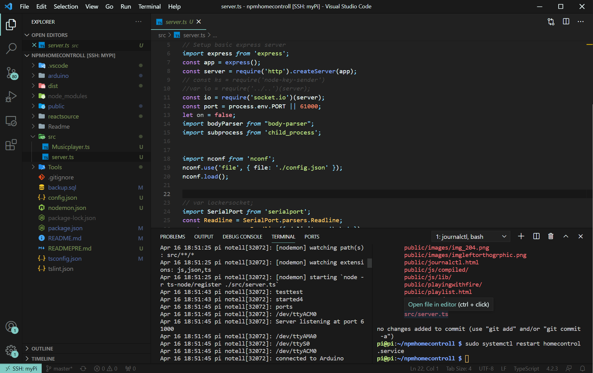

# 1 TobiasHomeAutomation

This repo contains a home automation system, in which I use to experiment with different technologies. It is written by myself for myself. The code is messy and unorganized, as it has grown "organically". The system assumes the presence of components such as an Arduino, a mopidy instance, and a mysql server, and thus likely won't run on other systems. It might however provide some inspiration for other developers.

The purpose of this readme is mainly for myself to keep track of commands and websites I've used, and is quite incomplete.

[Github](https://github.com/rumpelheinz/TobiasHomeAutomation)

Public Website:[https://tobias.eu.ngrok.io/](https://tobias.eu.ngrok.io/)

Music player on port 6680: [http://192.168.1.100:6680/](http://192.168.1.100:6680/)

# 2 Features & technologies used

## 2.1 Webinterface
### 2.1.1 Music & Room Control
The [/player](https://tobias.eu.ngrok.io/player) route is the interface for controlling the room. 
1. The buttons at the button send commands to the music player running on the pi. (Requires you to be logged in)
2. The two buttons on the bottom right send commands to the arduino to turn the desk lamp or the plant light in my room on or off.
3. A chart displays the room temperature and humidity measured by the arduino over the past 7 days. 
4. The log at the bottom displays the serial data from the arduino. The textfield allows you to directly send send commands to the arduino (Requires you to be logged in). 
5. The currently playing track, artist, and duration of the music playing in my room.
6. You can login, allowing you to use the functionalities to control the pi and arduino.

All communication happens over [socket.io](https://socket.io/). The graph is drawn using [Chart JS](https://www.chartjs.org/). The console log is written in react. The styling is made using css, and is based on the VSCode theme I'm using.

### 2.1.2 README
This readme is available at [/readme.html](https://tobias.eu.ngrok.io/readme.html)  
It is rendered using [Marked JS](https://marked.js.org/) and [Highlight JS](https://highlightjs.org/)

### 2.1.3 Game
My "playing with fire" clone is available at [/playingwithfire/playingwithfire.html](https://tobias.eu.ngrok.io/playingwithfire/playingwithfire.html), or on [my github](https://github.com/rumpelheinz/PlayingWithFirePhaser).

### 2.1.4 Step History
The amount of steps walked in the past 30 days of me and a few friends are available at [/dailysteps.html](https://tobias.eu.ngrok.io/dailysteps.html). 
We use the [XIAMI Mi Band 4 fitness trackers](https://www.mediamarkt.de/de/product/_xiaomi-mi-band-4-2567809.html) to measure step counts. 

I've build an [https://github.com/rumpelheinz/fjallkarta](Android app) based on the [Gadgetbridge app](https://gadgetbridge.org/). 




## 2.2 Raspberry Pi
The system uses a raspberry pi 3 to host the website, interface with the arduino, play music, and host the mysql server. (See [ssh](#9-ssh))

### 2.2.1 Development
All development happens over ssh. The Visual Studio Code ssh plugin offers plenty of functionality, and by now I rarely miss having a monitor connected to the pi. 


In order to automatically run the server, the scripts are run as a linux service. Using the journalctl command, you can review the logs for crashes, as well as monitor the script while it is running. The systemctl command allows you to restart the service while developing, and keeps everything running even when the ssh connection is closed. (See [service](#))

In addition to using a service, typescript is used for the main app, nodemon is used to recompile the script and restart it whenever the source files change. The configurations for this are in the package.json, nodemon.json, and the tsconfig.json files.

The code for the arduino is also compiled on the pi, using the [arduino-cli](https://www.arduino.cc/pro/cli) (See [arduino-over-ssh](#))


### 2.2.2 Music 
Throughought development, I have tested numerous music players, which all come with different ways to interact with them. 
1. Currently, the system uses (See [mopidy](#5-mopidy)), which runs headlessly and can e controlled through the [mpc-js package](https://github.com/hbenl/mpc-js-node) 
2. On a linux system with a screen, [cmus](https://wiki.archlinux.org/index.php/Cmus) can be made to autostart in a terminal. Node can then change the music using commands like `subprocess.exec("cmus-remote -C player-next");`.  To get the status of the music player, grep can be used using subprocess.spawn periodically.
3. To control normal desktop music players, the [node-key-sender package](https://www.npmjs.com/package/node-key-sender) can be used, e.g: `ks.sendCombination(['control', 'f8']);`

To change the sound volume, amixer commands are sent using subprocess. (See [volume](volume))

Additionally, pi is setup as a bluetooth device, acting as a bluetooth speaker for the smartphone. This was done using [this tutorial](https://github.com/nicokaiser/rpi-audio-receiver).

## 2.3 Arduino
An Arduino Mega 2560 is connected to the port. It has the following features:

1. Buttons that send commands to the pi (volume, play, next, etc..)
2. An infrared diode, used to control a [remote LED bulb](https://www.obi.at/e27-led/lightme-led-leuchtmittel-gluehlampenform-e27-10-w-810-lm-warmweiss-rgb-eek-a-/p/6774301) using the [IRremote library](https://github.com/Arduino-IRremote/Arduino-IRremote)
3.  [](https://github.com/adafruit/DHT-sensor-library)


# 3 Frequently used commands (#commands)
Start:
`npm start`

Stop Service:
`sudo systemctl stop homecontrol`

Restart Service:
`sudo systemctl restart homecontrol`

Get logs: 
`journalctl -u homecontrol -f`


Compiling arduino Code:
`arduino-cli compile --fqbn arduino:avr:mega arduino/infohub/ && arduino-cli upload -v -p /dev/ttyACM0 -b arduino:avr:mega arduino/infohub/`

Monitoring arduino
`minicom -D /dev/ttyACM0 -b 9600`

Compiling react scripts
`npx babel --watch src --out-dir public/js/compiled/ --presets react-app/prod`


# 4 Todo
- [ ] Add alerts when logged in as unknown user.
- [ ] Create a database for different users with privileges, propably using mysql.
- [ ] Convert site into single page react app.
- [ ] Show current sound volume in webinterface.
- [ ] Add moisture sensor to plant terrarium, and show data in webinterface.

# 5 Mopidy
Service at 
[/etc/systemd/system/mopidyservice.service]()

config at [/home/pi/.config/mopidy/mopidy.conf](file:///home/pi/.config/mopidy/mopidy.conf)
sudo systemctl restart mopidyservice.service

[/etc/systemd/system/mopidyservice.service](file:///etc/systemd/system/mopidyservice.service)


```properties
[Unit]
Description=My service
After=network.target

[Service]
Environment=STNORESTART=yes
ExecStart=/usr/local/bin/mopidy --config /home/pi/.config/mopidy/mopidy.conf
Restart=on-failure
RestartPreventExitStatus=1
SuccessExitStatus=2
RestartForceExitStatus=3 4


[Install]
WantedBy=multi-user.target
```

[/home/pi/.config/mopidy/mopidy.conf](file:///home/pi/.config/mopidy/mopidy.conf)
```properties
[core]
cache_dir = /home/pi/mopidy/cache
config_dir = /home/pi/mopidy/config
data_dir = /home/pi/mopidy/data
#max_tracklist_length = 10000
restore_state = true

[logging]
#verbosity = 0
#format = %(levelname)-8s %(asctime)s [%(process)d:%(threadName)s] %(name)s\n  %(message)s
#color = true
#config_file =

[audio]
#mixer = software
#mixer_volume = 
output = alsasink
#buffer_time = 

[proxy]
#scheme = 
#hostname = 
#port = 
#username = 
#password = 


[local]
enabled = true
media_dir = 
#  $XDG_MUSIC_DIR|Music
#  ~/|Home
  /home/pi/Music
excluded_file_extensions = 
  .directory
  .html
  .jpeg
  .jpg
  .log
  .nfo
  .pdf
  .png
  .txt
  .zip
#show_dotfiles = false
#follow_symlinks = false
#metadata_timeout = 5000


[file]
enabled = true
media_dirs = 
#  $XDG_MUSIC_DIR|Music
#  ~/|Home
  /home/pi/Music
excluded_file_extensions = 
  .directory
  .html
  .jpeg
  .jpg
  .log
  .nfo
  .pdf
  .png
  .txt
  .zip
show_dotfiles = false
follow_symlinks = false
metadata_timeout = 10000

[http]
enabled = true
hostname = 0.0.0.0
port = 6680
#zeroconf = Mopidy HTTP server on $hostname
#allowed_origins = 
#csrf_protection = true
default_app = mopidy

[m3u]
enabled = true
base_dir =/home/pi/mopidy/m3u
default_encoding = latin-1
default_extension = .m3u8
playlists_dir =

#[softwaremixer]
#enabled = true

[alsamixer]
card = 1
control = PCM
min_volume = 0
max_volume = 100
volume_scale = cubic


[stream]
#enabled = true
#protocols = 
#  http
#  https
#  mms
#  rtmp
#  rtmps
#  rtsp
#metadata_blacklist = 
#timeout = 5000

[mpd]
enabled = true
hostname = ::
port = 6610
password = 
max_connections = 20
connection_timeout = 60
zeroconf = Mopidy MPD server on $hostname
command_blacklist = 
  listall
  listallinfo
default_playlist_scheme = m3u

[spotify]
client_id = <CLIENT ID HERE> 
client_secret = <CLIENT SECRET HERE>
enabled=false
username = <USERNAME HERE>
password = ***********
[spotify_web]
client_id = <CLIENT ID HERE> 
client_secret = <CLIENT SECRET HERE>
```


Play next
`mpc --port=6610 next`


Play 
`mpc --port=6610 toggle`

Delete playlist:
`mpc --port=6610 rm <playlistname>`

Set volume to 100% :

`amixer -M sset 'Headphone' 100%`

`amixer -M sset 'PCM' 100%`

Test sound :

`aplay /usr/share/sounds/alsa/Front_Center.wav`

# 6 Running as a service

Service file at [/etc/systemd/system/homecontrol.service](file:///etc/systemd/system/homecontrol.service)

```properties
 [Unit]
Description=My service
After=network.target

[Service]
WorkingDirectory=/home/pi/npmhomecontroll/
ExecStart=/usr/local/bin/npm start
Restart=always
StandardOutput=syslog
StandardError=syslog
SyslogIdentifier=notell
User=pi
Group=pi
Environment=NODE_ENV=production


[Install]
WantedBy=multi-user.target
```

Restart :
`sudo systemctl restart homecontrol`

Enable:
`sudo systemctl enable homecontrol`

Get logs:
`journalctl -u homecontrol -f`


## 6.1 SQL
I use [Mariadb](https://mariadb.org/) as the MySQL server to store the step history and room temperature.

Logging in:

`mysql -u <username> -p`

<password>

`use <dbname>`

`delete from <dbname> where name="te'st";`

`show tables;`

`SHOW COLUMNS FROM <tablename>;`


Backup: `mysqldump -u <username> <dbname> -p >backup.sql`

File 
```SQL

CREATE TABLE `steps` (
  `datum` date NOT NULL,
  `steps` int(11) DEFAULT NULL,
  `name` varchar(30) NOT NULL,
  PRIMARY KEY (`datum`,`name`)
);

CREATE TABLE `humiditytemp` (
  `datum` timestamp NOT NULL DEFAULT current_timestamp() ON UPDATE current_timestamp(),
  `humidity` float NOT NULL,
  `temp` float NOT NULL,
  PRIMARY KEY (`datum`)
);

CREATE TABLE `updates` (
  `name` varchar(30) DEFAULT NULL,
  `time` timestamp NOT NULL DEFAULT current_timestamp()
);
```

# 7 ngrok
Service at [/etc/systemd/system/ngrokservice.service]
```properties

[Unit]
Description=My service
After=network.target

[Service]

WorkingDirectory=/home/pi/
ExecStart=/home/pi/ngrok start --all
Restart=always
StandardOutput=syslog
StandardError=syslog
SyslogIdentifier=notell
User=pi
Group=pi


[Install]
WantedBy=multi-user.target
```

config at [~/.ngrok2/ngrok.yml]

```YAML
authtoken: <AUTHTOKEN HERE>
region: eu
tunnels:
        webpage:
                proto: http
                addr: <APPLICATION TOKEN HERE>
                hostname: tobias.eu.ngrok.io    
        myssh:
                proto: tcp
                addr: <SSH PORT HERE>
                remote_addr: <NGROK TCP PORT HERE>
```

# 8 Arduino


Programming: [https://siytek.com/arduino-cli-raspberry-pi/#Install_Arduinocli](https://siytek.com/arduino-cli-raspberry-pi/#Install_Arduinocli)

`arduino-cli config init`
`arduino-cli sketch new blink`

`arduino-cli core update-index`
`arduino-cli board list`
`arduino-cli board listall`

`arduino-cli core install arduino:avr`

`arduino-cli compile --fqbn arduino:avr:mega infohub/`

`arduino-cli upload -v -p /dev/ttyUSB0 -b arduino:avr:nano:cpu=atmega328old infohub/`

arduino:avr:mega

`arduino-cli upload -v -p /dev/ttyACM0 -b arduino:avr:mega infohub/`
                          

`arduino-cli compile --fqbn arduino:avr:mega infohub/ &&
arduino-cli upload -v -p /dev/ttyACM0 -b arduino:avr:mega infohub/`

`screen /dev/ttyUSB0`
(kill with ctrl-a k)

`minicom -D /dev/ttyACM0 -b 9600`

`stty -F /dev/ttyUSB0 9600 raw -clocal -echo`
`cat /dev/ttyUSB0`


# 9 SSH

## 9.1 Remove need for password
`ssh-keygen` on main pc

Copy public key to pi
`ssh-copy-id <pi>@<Pi-IP-ADDRESS>`

# 10 SSH Copy Files

`scp <file1from> [file2from...] <pi@targetaddr:targetpath/>`

`scp /home/tobias/Downloads/deadmau5_* pi@192.168.1.100:/home/pi/Music/concentration`


# 11 Arduino Remote

[Infrared Sender and receiver](https://github.com/z3t0/Arduino-IRremote)

IR codes IRReceiveDemo

`
Protocol=NEC Data=0xFFE01F
Protocol=NEC Data=0xFF609F
`

```C++
if ( on) {
                IrSender.sendNEC(0xFFE01F, 32);
  }
  else {
            IrSender.sendNEC(0xFF609F, 32);
  }
  on=!on;
```


`cd  arduino/libraries`
`git clone https://github.com/z3t0/Arduino-IRremote.git`


# 12 Links
Bluetooth audio receiver: [https://github.com/nicokaiser/rpi-audio-receiver](https://github.com/nicokaiser/rpi-audio-receiver)
